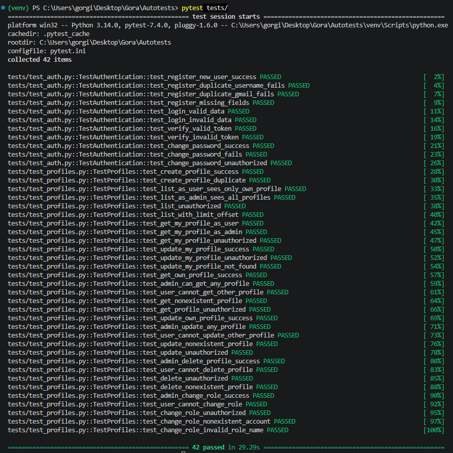

# Автотесты для API

## Структура проекта

```
AUTOTESTS/
├── endpoints/ # Классы эндпоинтов с методами проверок
├── tests/ # Папка с тестами (аутентификация и профили)
├── conftest.py # Фикстуры с данными
├── pytest.ini # Инициализация библиотеки pytest
├── requirements.txt # Зависимости проекта
└── .gitignore # Исключаемые файлы
```

## Структура кода

### Тесты авторизации (файл test_auth.py)
Здесь написаны тесты для эндпоинтов в категории Authentication:
- register
- login
- verify
- change-password

Для каждого запроса был создан отдельный класс с методами проверок.  

Для авторизации это файлы в `endpoints/`:
- register_profile.py
- login_user.py
- verify_user.py
- change_password.py

Всего вышло 11 тестов авторизации.

### Тесты профилей (файл test_profiles.py)
Здесь написаны тесты для эндпоинтов в категории Profiles:
- profiles
- profiles/me
- profiles/{account_id}
- profiles/{account_id}/role  

Были протестированы api методы POST, GET, PUT, DELETE.  
Тут аналогично для каждого запроса был создан отдельный класс с методами проверок. 
 
Файлы в `endpoints/`:
- create_profile.py
- get_list_profiles.py
- get_my_profile.py
- update_my_profile.py
- get_profile.py
- update_profile.py
- delete_profile.py
- update_account_role.py

Всего вышло 31 тест профилей.

## Запуск автотестов

1. установка библиотек
```
pip install -r requirements.txt
```
2. запуск всех автотестов
```
pytest tests/
```  
*запуск по маркерам*
```
pytest -m auth            # только тесты аутентификации
pytest -m profile         # только тесты профилей
```

## Результаты тестов
